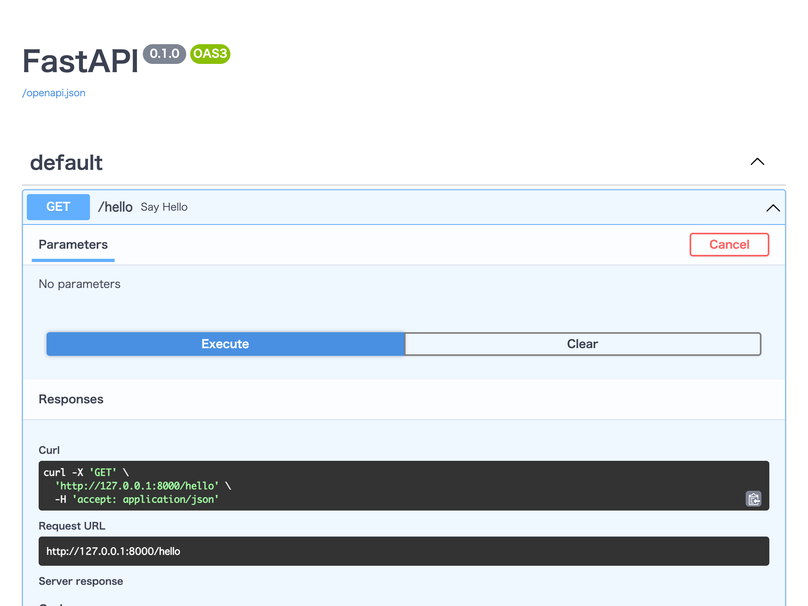

# 📘 第2章：FastAPI 環境の準備
🕒本章の作業時間：15分

## 🎯 この章の目的
この章では、FastAPI を使って API サーバーを構築するための準備を行います。

* FastAPI の基本構造を知る
* 作業用ディレクトリをセットアップする
* 仮想環境を作成して依存ライブラリを導入する
* FastAPI アプリを起動して、API が動く状態を確認する

## 📦 2-1. FastAPI とは？

FastAPI は、Python で Web API を素早く簡単に構築できるフレームワークです。\
以下のような特徴があります：

* **高速**：
  * 非同期処理に対応しており、非常に高いパフォーマンスを発揮します。
* **型ヒント対応**：
  * Python の型ヒントを活かして、リクエストやレスポンスのバリデーションが自動で行えます。
* **ドキュメント自動生成**：
  * OpenAPI / Swagger に対応し、ブラウザ上で API を操作できる画面が自動生成されます。
* **学習コストが低い**：
  * Python の基本文法がわかればすぐに使い始められます。

### 👩🏻‍💻もっと知りたい方へ
Shingen.py では、過去に FastAPI のワークショップを実施しています。  

* [FastAPI でハジメルPython](https://shingenpy.connpass.com/event/213263/) 2021/06/17(木)開催
  * [スライド資料](https://www.slideshare.net/slideshow/start-python-with-fastapi/249422898)
  * [ドキュメント/サンプルコード](https://github.com/shingenpy/fastapi_workshop)

## 🧰 2-2. 作業ディレクトリの準備
作業用のディレクトリを作成し、移動します：

```bash
mkdir hello-fastapi
cd hello-fastapi
```
この中で Python プロジェクトを構築していきます。

## 📦 2-3. ライブラリのインストール
FastAPI および API呼び出し用の httpx、開発用サーバー uvicorn をインストールします。

```bash
pip install fastapi httpx uvicorn
```
※ uvicorn は FastAPI アプリを起動するためのサーバーです。

## 📄 2-4. 最小の FastAPI アプリを作ってみよう
エディタ（VS Code など）で main.py というファイルを作成し、以下のコードを入力します。

📄 main.py
```python
from fastapi import FastAPI

app = FastAPI()

@app.get("/hello")
async def say_hello():
    return {"message": "こんにちは、FastAPI！"}
```
このコードは、/hello というURLにアクセスすると「こんにちは、FastAPI！」という JSON を返すだけの最小構成です。

## 🚀 2-5. FastAPI アプリを起動する
ターミナルで次のコマンドを実行して、FastAPI アプリを起動します。

```bash
uvicorn main:app --reload
```
起動に成功すると、以下のようなメッセージが表示されます：

```
INFO:     Uvicorn running on http://127.0.0.1:8000
```
ブラウザで以下のURLにアクセスしてください：

* http://127.0.0.1:8000/hello
→ JSON で {"message": "こんにちは、FastAPI！"} が表示されれば成功です。

## 🧪 2-6. Swagger UI を試す
FastAPI は、自動的に API ドキュメントを生成してくれます。

ブラウザで以下のURLにアクセスしてみましょう：

+ http://127.0.0.1:8000/docs

このページでは、提供している API エンドポイントを確認したり、ボタンでリクエストを送って実行結果を見ることができます。

Swagger UI と呼ばれるこの画面は、API 開発・テストにとても便利です。



## 📥 2-7. FastAPI で扱う3種類のパラメータ
FastAPI では、API を通じて受け取る値の定義が非常に簡潔です。  
ここでは、以下の3つのパラメータの受け取り方法を学びます。

### 🧭 2-7-1. パスパラメータ（Path Parameter）
URL の一部として値を渡す方法です。  
たとえば `/users/1` のように、ユーザーIDを URL の一部として受け取ります。

📄 `main.py` に追記：
```python
@app.get("/users/{user_id}")
async def get_user(user_id: int):
    return {"user_id": user_id}
```
→ `/users/123` にアクセスすると `{"user_id": 123}` が返ります。

### 🔍 2-7-2. クエリパラメータ（Query Parameter）
`/search?keyword=python` のように、`?` のあとに続く形式のパラメータです。

📄 `main.py` に追記：
```python
@app.get("/search")
async def search(keyword: str = "default"):
    return {"keyword": keyword}
```

→ `/search?keyword=fastapi` にアクセスすると `{"keyword": "fastapi"}` が返ります。

### 📨 2-7-3. ボディパラメータ（Request Body）
POST リクエストなどで、JSON データなどをリクエストボディとして送信します。

📄 `main.py` に追記：
```python
from pydantic import BaseModel

class Item(BaseModel):
    name: str
    price: float

@app.post("/items/")
async def create_item(item: Item):
    return {"name": item.name, "price": item.price}
```

このエンドポイントには、次のような JSON を POST で送信します：
```json
{
  "name": "マグカップ",
  "price": 1200
}
```
→ レスポンス: `{"name": "マグカップ", "price": 1200}`

Swagger UI からも試せます！

### 💡 2-7-4. 補足：パラメータの使い分けガイド
FastAPI では、以下のようにパラメータの使いどころを分けて設計すると自然です。

| 種類 | 使う場面 | 具体例 | 備考 |
| ---- | ---- | ---- | ---- |
| **パスパラメータ** | **リソースを一意に識別する時** | `/users/42` → ユーザーID:42 | 「何を操作するか」を示すときに使う |
| **クエリパラメータ** | **検索条件やオプション指定** | `/search?keyword=python&limit=5` | 「どう検索するか」や「並び順」など |
| **ボディパラメータ** | **データを新規作成・更新するとき** | POST `/items` に JSON を送信 | 複数の項目をまとめて渡すのに向いている |

> 🧭 ちなみに…
こうした設計は「REST API」という考え方に基づいています。  
本ハンズオンではそこまで深入りしませんが、興味がある人は「REST API 設計」などのキーワードで調べてみてください！

## ❓ よくあるトラブルと対処法

| 状況 | 対処法 |
| ---- | ---- |
| `uvicorn: command not found` | 仮想環境が有効になっていない可能性があります。`source .venv/bin/activate` を再確認してください。 |
| `ModuleNotFoundError: fastapi` | ライブラリが入っていない可能性があります。`pip install fastapi` を再実行してください。 |
| アプリが起動しない／ポートが重複 | 既に `uvicorn` が起動している場合があります。`Ctrl+C` で停止してから再実行してください。 |

## ✅ この章のまとめ

* FastAPI の基本構成と、起動手順を理解しました
* 最小の API エンドポイント /hello を動かすことができました
* Swagger UI によって、視覚的に API を確認する方法を学びました
* FastAPI で扱える3種類のパラメータ（パス・クエリ・ボディ）を使って API を作成しました

次章では、いよいよ connpass API v2 を FastAPI アプリの中から呼び出し、自作の API サーバを完成させていきます！

👉 次に進む：[第3章：connpass API を活用した実用的 API の構築](3_build-api.md)