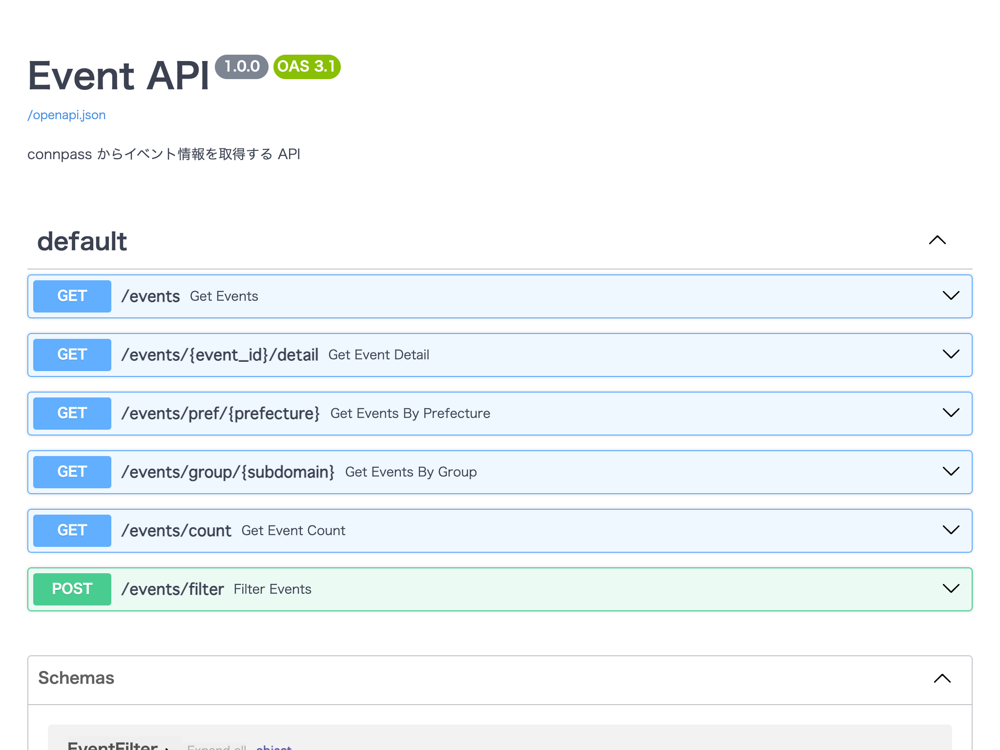

# 📘 第3章：connpass API を活用した実用的 API の構築
🕒本章の作業時間：30分

## 🎯 3-1. この章の目的
この章では、外部API（connpass API v2）を FastAPI でラップすることで、

* 外部の複雑なAPIを「わかりやすい」形に変換する方法
* 条件によるフィルタ処理やデータ整形の実装
* パラメータの受け取り（クエリ／パス／ボディ）の違い

を学びます。

FastAPI の「API設計力」と「柔軟性」の両方を体験する章です。

## 🔧 3-2. 実装方針
この章では、1つの main.py に複数のエンドポイントを定義し、connpass API v2 をベースにした次のAPIを構築します：

| エンドポイント | メソッド | 説明 |
| ---- | ---- | ---- |
| `/events` | `GET` | キーワード検索 |
| `/events/{event_id}/detail` | `GET` | イベント詳細取得 |
| `/events/pref/{prefecture}` | `GET` | 都道府県でフィルタ |
| `/events/group/{subdomain}` | `GET` | グループでフィルタ |
| `/events/count` | `GET` | イベント件数のみ取得 |
| `/events/filter` | `POST` | 柔軟な複数条件での検索 |

## 🧰 3-3. 作業ディレクトリの準備
作業用のディレクトリを作成し、移動します：

```bash
mkdir my-event-api
cd my-event-api
```
この中で Python プロジェクトを構築していきます。

## 📦 3-4. ライブラリのインストール
FastAPI 等必要なライブラリをインストールします。

```bash
pip install fastapi httpx python-dotenv uvicorn
```
または
```bash
pip install "fastapi[all]" python-dotenv
```

## 📄 3-5. main.py（全体構成）
以下に、FastAPI アプリ全体を構成する main.py のコードを記載します。

- 完全版の main.py はこちらにあります：[main.py](https://github.com/shingen-py/doc_20250726/blob/main/01_fastapi-handson/sample_apps/my-event-api/main.py)

### 🔐 前提：API キー設定

`.env` ファイルの作成

```ini
CONNPASS_API_KEY=あなたのAPIキー
```

### ✅ 共通関数
```python
from fastapi import FastAPI, HTTPException, Path
from fastapi.middleware.cors import CORSMiddleware
from pydantic import BaseModel
import httpx
import os
from dotenv import load_dotenv

load_dotenv()  # .env ファイルを読み込む

app = FastAPI()

app.title = "Event API"
app.description = "connpass からイベント情報を取得する API"
app.version = "1.0.0"

# CORS(Cross-Origin Resource Sharing) 設定
app.add_middleware(
    CORSMiddleware,
    # 許可するオリジンを指定(本番では適切なオリジンに制限すること)
    allow_origins=["*"],
    # 認証情報を含むリクエストを許可
    allow_credentials=True,
    # 許可するHTTPメソッドを指定
    allow_methods=["*"],
    # 許可するHTTPヘッダーを指定
    allow_headers=["*"],
)

# APIキーを環境変数から取得
API_KEY = os.getenv("CONNPASS_API_KEY")

# connpass API の URL
# BASE_URL = "https://connpass.com/api/v2"  # 公式の connpass API
BASE_URL = "https://proxy01.yamanashi.dev"  # 勉強会用のプロキシサーバー


# ---- 共通のイベント取得関数 ----
async def fetch_events(
    event_id: int | None = None,    # イベントIDでの絞り込み
    keyword: str | None = None,     # キーワードでの絞り込み
    subdomain: str | None = None,   # サブドメイン(グループ)での絞り込み
    prefecture: str | None = None,  # 都道府県での絞り込み
    order: int = 2,                 # 検索結果の表示順(2: 開始日時の降順)
    count: int = 10,                # 取得件数
):
    """
    connpass API からイベント情報を取得する共通関数
    """
    url = f"{BASE_URL}/events/"
    headers = {"X-API-Key": API_KEY}
    params = {
        "event_id": event_id,
        "keyword": keyword,
        "subdomain": subdomain,
        "prefecture": prefecture,
        "order": order,
        "count": count,
    }
    print(f"Fetching events with params: {params}")

    async with httpx.AsyncClient() as client:
        try:
            response = await client.get(url, headers=headers, params=params)
            response.raise_for_status()
            return response.json()

        except httpx.HTTPError as e:
            raise HTTPException(status_code=500,
                                detail=f"connpass API エラー: {e}")
```

### ✅ 1. `/events` – イベント一覧
```python
app.get("/events")
async def get_events(
    keyword: str = "",
    limit: int = 10
):
    """
    イベントの一覧を取得するエンドポイント
    """
    data = await fetch_events(
        keyword=keyword,
        count=limit
    )
    events = data.get("events", [])

    return [
        {
            "id": event["id"],                  # イベントID
            "title": event["title"],            # イベント名
            "url": event["url"],                # connpass.com上のURL
            "started_at": event["started_at"],  # イベント開始日時
            "place": event.get("place"),        # 開催会場
        } for event in events
    ]
```

### ✅ 2. `/events/{event_id}/detail` – イベント詳細
```python
@app.get("/events/{event_id}/detail")
async def get_event_detail(event_id: int):
    """
    イベントの詳細情報を取得するエンドポイント
    """
    data = await fetch_events(event_id)

    if not data or "events" not in data or len(data["events"]) == 0:
        raise HTTPException(status_code=404, detail="イベントが見つかりません")

    event = data["events"][0]

    return {
        "id": event["id"],                              # イベントID
        "title": event["title"],                        # イベント名
        "catch": event.get("catch"),                    # キャッチ
        "description": event.get("description"),        # 概要
        "url": event["url"],                            # connpass.com上のURL
        "started_at": event["started_at"],              # イベント開始日時
        "ended_at": event.get("ended_at"),              # イベント終了日時
        "group": event.get("group", {}).get("title"),   # グループ名
        "address": event.get("address"),                # 開催場所
        "place": event.get("place"),                    # 開催会場
    }
```

### ✅ 3. `/events/pref/{prefecture}` – 都道府県でフィルタ
```python
@app.get("/events/pref/{prefecture}")
async def get_events_by_prefecture(
    prefecture: str = Path(..., description="都道府県（例: yamanashi）"),
    keyword: str = "",
    limit: int = 10
):
    """
    都道府県別のイベントを取得するエンドポイント
    """
    data = await fetch_events(
        keyword=keyword,
        prefecture=prefecture,
        count=limit
    )
    events = data.get("events", [])

    return [
        {
            "id": event["id"],                  # イベントID
            "title": event["title"],            # イベント名
            "url": event["url"],                # connpass.com上のURL
            "started_at": event["started_at"],  # イベント開始日時
            "place": event.get("place"),        # 開催会場
        } for event in events
    ]
```

### ✅ 4. `/events/group/{subdomain}` – グループでフィルタ
```python
@app.get("/events/group/{subdomain}")
async def get_events_by_group(
    subdomain: str = Path(..., description="グループのサブドメイン（例: shingenpy, jaws-ug-yamanashi）"),
    keyword: str = "",
    limit: int = 10
):
    """
    グループ別のイベントを取得するエンドポイント
    """
    data = await fetch_events(
        keyword=keyword,
        subdomain=subdomain,
        count=limit
    )
    events = data.get("events", [])

    return [
        {
            "id": event["id"],                  # イベントID
            "title": event["title"],            # イベント名
            "url": event["url"],                # connpass.com上のURL
            "started_at": event["started_at"],  # イベント開始日時
            "place": event.get("place"),        # 開催会場
        } for event in events
    ]
```

### ✅ 5. `/events/count` – 件数のみを返す
```python
@app.get("/events/count")
async def get_event_count(keyword: str = ""):
    """
    イベントの総件数を取得するエンドポイント
    """
    data = await fetch_events(
        keyword=keyword,
        count=1
    )
    count = data.get("results_available", 0)    # 検索結果の総件数

    return {"count": count}
```

### ✅ 6. `/events/filter` – POSTで柔軟に検索

📦 リクエストモデル（Pydantic）
```python
class EventFilter(BaseModel):
    """
    イベント検索リクエストのモデル
    """
    keyword: str = ""
    prefecture: str | None = None
    subdomain: str | None = None
    limit: int = 10
```

📡 実装
```python
@app.post("/events/filter")
async def filter_events(filter: EventFilter):
    """
    イベントをキーワード、都道府県、グループで検索するエンドポイント
    """
    data = await fetch_events(
        keyword=filter.keyword,
        prefecture=filter.prefecture,
        subdomain=filter.subdomain,
        count=filter.limit
    )
    events = data.get("events", [])

    return [
        {
            "id": event["id"],                  # イベントID
            "title": event["title"],            # イベント名
            "url": event["url"],                # connpass.com上のURL
            "started_at": event["started_at"],  # イベント開始日時
            "place": event.get("place"),        # 開催会場
        } for event in events
    ]
```

## ✅ この章で学ぶ FastAPI 機能

| 機能 | エンドポイントでの使用例 |
| ---- | ---- |
| クエリパラメータ | `/events`, `/events/count` |
| パスパラメータ | `/events/{event_id}/detail`, `/events/pref/{prefecture}`, `/events/group/{subdomain}` |
| ボディパラメータ（Pydantic） | `/events/filter` |
| JSONレスポンス整形 | 各エンドポイントの return 箇所で実装 |

## 🚀 3-6. FastAPI アプリを起動する
ターミナルで次のコマンドを実行して、FastAPI アプリを起動します。

```bash
uvicorn main:app --reload
```
ブラウザで以下のURLにアクセスし、色々リクエストしてみましょう：

* [http://127.0.0.1:8000/docs](http://127.0.0.1:8000/docs)



## 🔒 補足：CORS（Cross-Origin Resource Sharing）の話

**フロントエンドや他のWebアプリ**からこのAPIを利用する場合、  
ブラウザがCORS制限をかけて通信をブロックしてしまいます

FastAPI 側で CORS Middleware を設定することで、  
意図的に外部からのアクセスを許可する必要があります

次章以降で扱う「AWS LambdaでAPIを公開」する際にも、CORS設定は重要になります

### 以下のような構成では CORS が必要になります

* フロント（localhost:3000） → FastAPI（localhost:8000）に**直接fetch**（次章）
* フロントを Vite や React で別ポートで開発
* API を AWS や外部サーバにデプロイ
* フロントエンドを別のドメインでホストしている場合

## ✅ この章のまとめ

* connpass API を FastAPI で「ラップ」して、自分専用のAPIを設計
* クエリやPOST、整形レスポンスなど 柔軟で使いやすいAPIを自分で構築
* 今後の応用に向けて、CORS対応も含めた基本設定を理解

次章では、このAPIを実際にWeb UIから使ってみる体験に進みます。
ここまでで構築した FastAPI アプリはそのまま活用していきます。

👉 次に進む：[第4章：APIを実際に使ってみる（Webフロント）](4_use-api.md)