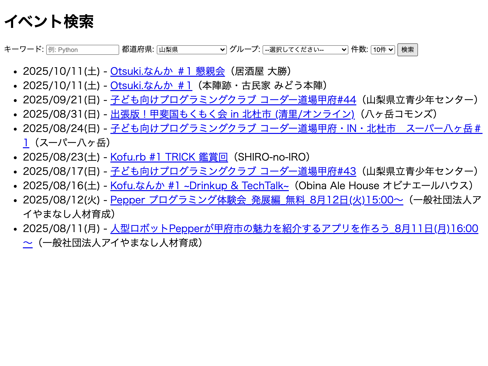

# 📘 第4章：APIを実際に使ってみる（Webフロント）
🕒本章の作業時間：15分

## 🎯 この章の目的
構築した FastAPI の API を、Webブラウザ上の HTML + JavaScript アプリケーションから実際に使ってみます。  
この章では、**Python の標準モジュール `http.server` を用いて、HTML ファイルをローカル配信**する方法で進めます。

### この章で得られること

* Web フロントから API を使う体験
* HTML/JS のフォーム UI から fetch を通じて API を呼び出す流れの理解
* API の利用場面（検索アプリ）を通じて「作って終わりではない」ことを実感

## 🧭 システム構成図

```plaintext
[ブラウザ]
   |
   | fetch http://localhost:8000/events/filter
   v
[FastAPI (http://localhost:8000)]
```

## 🧱 ディレクトリ構成

```plaintext
my-event-frontend/
└── index.html        ← HTML + JavaScript
```

## 📄 index.html
以下の内容を `my-event-frontend/index.html` に保存してください：

```html
<!DOCTYPE html>
<html lang="ja">
<head>
  <meta charset="UTF-8" />
  <title>イベント検索</title>
</head>
<body>
  <h1>イベント検索</h1>

  <label>
    キーワード:
    <input id="kw" placeholder="例: Python" />
  </label>

  <label>
    都道府県:
    <select id="pref">
      <option value="">--選択してください--</option>
      <option value="yamanashi">山梨県</option>
      <option value="tokyo">東京都</option>
      <option value="shizuoka">静岡県</option>
      <option value="nagano">長野県</option>
    </select>
  </label>

  <label>
    グループ:
    <select id="subdomain">
      <option value="">--選択してください--</option>
      <option value="shingenpy">shingen.py</option>
      <option value="jaws-ug-yamanashi">JAWS-UG山梨</option>
      <option value="kainokuni">甲斐国もくもく会</option>
      <option value="coderdojokofu">コーダー道場甲府</option>
      <option value="houtoupm">Houtou.pm</option>
      <option value="kofurb">Kofu.rb</option>
      <option value="ai-meetup">東京-山梨 AI ミートアップ</option>
    </select>
  </label>

  <label>
    件数:
    <select id="limit">
      <option value="5">5件</option>
      <option value="10" selected>10件</option>
      <option value="20">20件</option>
      <option value="50">50件</option>
    </select>
  </label>

  <button onclick="search()">検索</button>

  <ul id="results"></ul>

  <script>
    function formatDate(dateStr) {
      const date = new Date(dateStr);
      return date.toLocaleDateString("ja-JP", {
        year: "numeric",
        month: "2-digit",
        day: "2-digit",
        weekday: "short"
      });
    }

    async function search() {
      const kw = document.getElementById('kw').value;
      const pref = document.getElementById('pref').value;
      const subdomain = document.getElementById('subdomain').value;
      const limit = document.getElementById('limit').value;

      const res = await fetch('http://localhost:8000/events/filter', {
        method: 'POST',
        headers: { 'Content-Type': 'application/json' },
        body: JSON.stringify({
          keyword: kw,
          prefecture: pref,
          subdomain: subdomain,
          limit: Number(limit)
        })
      });

      const data = await res.json();
      const ul = document.getElementById('results');
      ul.innerHTML = "";
      data.forEach((e) => {
        const dateStr = formatDate(e.started_at);
        const li = document.createElement("li");
        li.innerHTML = `${dateStr} - <a href="${e.url}" target="_blank">${e.title}</a>（${e.place ?? '場所未定'}）`;
        ul.appendChild(li);
      });
    }
  </script>
</body>
</html>
```

## ✅ 動作手順

### ① FastAPI サーバーを起動
第3章で作成した FastAPI サーバーを起動します。
```bash
cd my-event-api
uvicorn main:app --reload
```

### ② HTML ファイルをローカル配信（別ターミナルから）
```bash
cd my-event-frontend
python3 -m http.server 3000
```

### ③ ブラウザで検索体験！

* ブラウザで `http://localhost:3000` を開く
* 都道府県やグループを選択して検索
* FastAPI を通じて connpass API のデータが表示される 🎉

!

## 🧩 CORS（クロスオリジン）への補足
* `http://localhost:3000`（HTML）から `http://localhost:8000`（API）を呼ぶため、クロスオリジン通信になります
* FastAPI 側で CORS 対応が必要です（第3章ですでに対応済）

## ✅ この章のまとめ

* HTML + JavaScript で作られた Web フロントから FastAPI の API を呼び出す体験をしました
* Python 標準モジュール http.server によるローカル配信を通じて、HTML ファイルをブラウザで表示しました
* API の実用性（検索連携）を目で見て確認できました
* 今後の公開時（例：AWS Lambda）に向けて CORS の重要性にも触れました

次章では、ここまでのハンズオンの振り返りと、FastAPIやAPI構築を今後どのように活かしていくかを考えます。

👉 次に進む：[第5章：まとめと今後のステップ）](5_summary.md)
