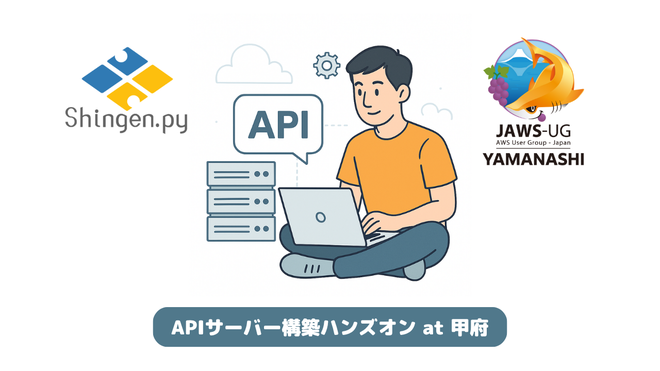

# [Shingen.py|JAWS-UG山梨]connpassAPIで学ぶAPIサーバー構築ハンズオン

## この勉強会について

山梨のPythonユーザーコミュニティ「[Shingen.py](https://shingenpy.connpass.com/)」が主催する、初心者向けPython勉強会です！  
今回は山梨のAWSユーザーコミュニティ「[JAWS-UG山梨](https://jaws-ug-yamanashi.connpass.com/)」とのコラボ企画！

IT勉強会支援プラットフォーム「[connpass](https://connpass.com/)」のAPIを題材に、Python製のWebフレームワークFastAPIを使ったAPIサーバの構築から、AWSでサーバレスでのAPI公開までを体験するハンズオン形式の勉強会です。

APIの開発を経験したことがない方も、実際に手を動かしながらAPIサーバーの構築を体験してみましょう！

💁🏻‍♀️このような方にオススメです

* 最近 Python を勉強し始めた方で、FastAPI を用いてAPIサーバーの開発を体験したい方
* connpass API でどんなことが出来るのか実際に試してみたい方
* AWS Lambda を用いて、API サーバーの公開までを体験したい方

開催URL: [https://shingenpy.connpass.com/event/357093/](https://shingenpy.connpass.com/event/357093/)

---
## FastAPI を使った APIサーバー構築ハンズオン

- [資料はこちら](01_fastapi-handson/README.md)
- 
## AWS Lambda を使った APIサーバー公開ハンズオン

- 資料リンクは後ほど追加